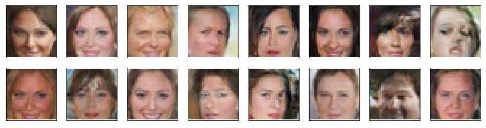

# Generate Faces
This repository is my solution to `Project 4` of Udacity's [Deep Learning Nanodegree](https://www.udacity.com/course/deep-learning-nanodegree--nd101). In this project, I built a Deep Convolutional Generative Adversarial Network (DCGAN), trained on the [CelebFaces Attributes Dataset](http://mmlab.ie.cuhk.edu.hk/projects/CelebA.html) and generated "fake" celebrity images that look as realistic as the images in the original dataset. 

Here are some of the samples from the original dataset:

And the samples from the trained generator network:

## Models
* DCGAN from the [paper](https://arxiv.org/pdf/1511.06434.pdf)

## Author(s)
* **Hashir Ahmad** - *full project* - [GitHub](https://github.com/hash-ir)

## License
This project is licensed under the MIT License - see the [LICENSE](https://github.com/hash-ir/Generate-Faces/blob/master/LICENSE) file for details
